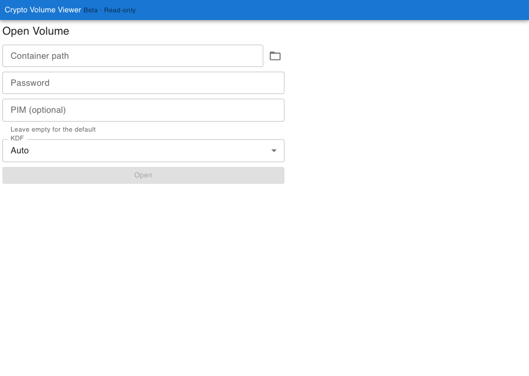
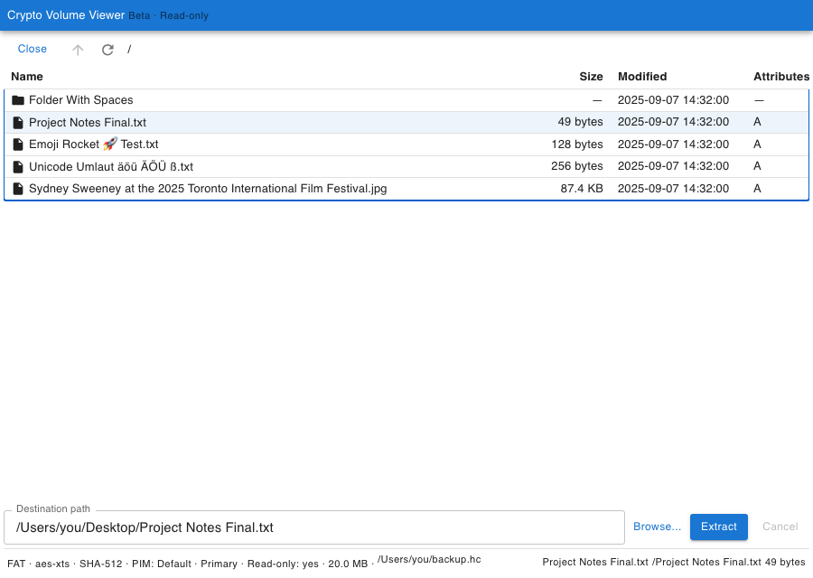

# Crypto Volume Viewer

Read-only macOS app (and `cryptovol` CLI) for looking inside TrueCrypt/VeraCrypt-compatible **file containers** and extracting a single file. No mount. No FUSE. No kernel extension. No write.

Not affiliated with VeraCrypt, TrueCrypt, Apple, or anyone else.





## Download (macOS)

Signed, notarized builds: **[Releases](https://github.com/TilmannF/crypto-volume-viewer/releases/latest)**.

```bash
shasum -a 256 -c SHA256SUMS.txt
```

Then open the `.dmg` and drag **Crypto Volume Viewer** to Applications. Gatekeeper should accept it (Developer ID + notarized).

Apple silicon (`aarch64`) only for this release. Intel Macs are not packaged yet.

## What it does

- Opens a file-hosted TC/VC-compatible container with the password you already have
- AES-XTS; KDF autoprobe: SHA-512, SHA-256, Whirlpool, BLAKE2s-256, Streebog; optional PIM
- Lists FAT (LFN/Unicode), exFAT, NTFS
- Extracts **one file**, streamed, with progress and cancel in the GUI
- CLI: `info`, `test-open`, `probe-fs`, `ls`, `extract`

## What it does not

Keyfiles, hidden volumes, partition/system volumes, directory extract, write, mount, FUSE, password recovery, brute force. No telemetry, no auto-update, no network.

Support is tested against this repo’s own fixtures, not “every VeraCrypt volume on earth.”

## Privacy and security

Local only. [Privacy policy](docs/privacy.md). [Security model](docs/security.md). Vulnerabilities: **cryptovol@flgnr.com**, not a public issue. See [SECURITY.md](.github/SECURITY.md).

Extracted files are no longer encrypted. You pick the destination.

## Clone warning

`git clone` pulls about **120 MB** of committed test containers under `testdata/static/`. That is on purpose so listing/extraction tests are reproducible. Generated extra containers stay gitignored (`testdata/generated/`).

Test password for those fixtures: `test-password`. Do not put real private volumes in git.

One fixture payload is a Wikimedia photo used as binary/LFN test data, not as app content. Credit: [docs/test-containers.md](docs/test-containers.md).

## Build from source

Rust 1.85+, Node 22 for the GUI.

```bash
cargo build                     # CLI → cryptovol
cd apps/cryptovol-gui && npm ci && npm run tauri dev
```

Checks: [CONTRIBUTING.md](CONTRIBUTING.md). Packaging: [docs/packaging-macos.md](docs/packaging-macos.md).

## CLI

```bash
cryptovol info backup.hc
cryptovol test-open backup.hc --kdf sha512
cryptovol ls backup.hc /
cryptovol extract backup.hc /documents/report.pdf ./report.pdf
```

Password is prompted, never a `--password` flag.

## Written by AI

This codebase is **100% AI-written**, directed by Tilmann Felgner. Started with **Codex**, then **Claude**, recently **Grok**. Details: [docs/ai.md](docs/ai.md). `AGENTS.md` and `policies/` are the rules those models are told to follow.

## License

Apache-2.0. Copyright 2026 Tilmann Felgner. [LICENSE](LICENSE), [NOTICE](NOTICE).

## Issues

Bugs and limitations: [GitHub Issues](https://github.com/TilmannF/crypto-volume-viewer/issues). Not a place to recover a forgotten password.
